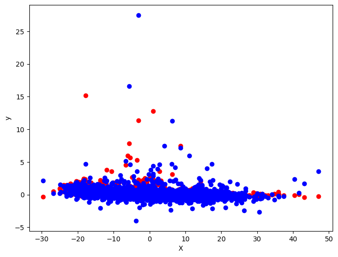
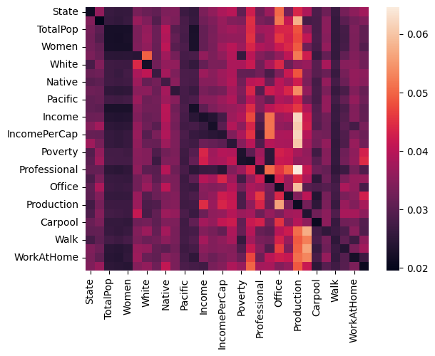
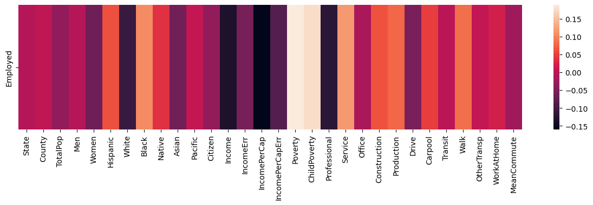
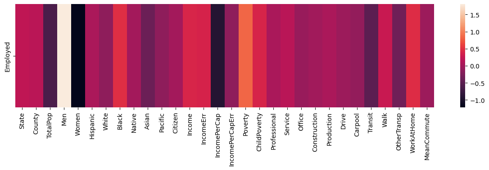
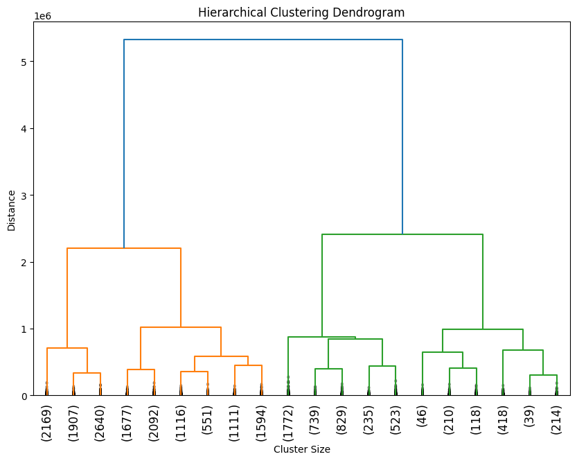
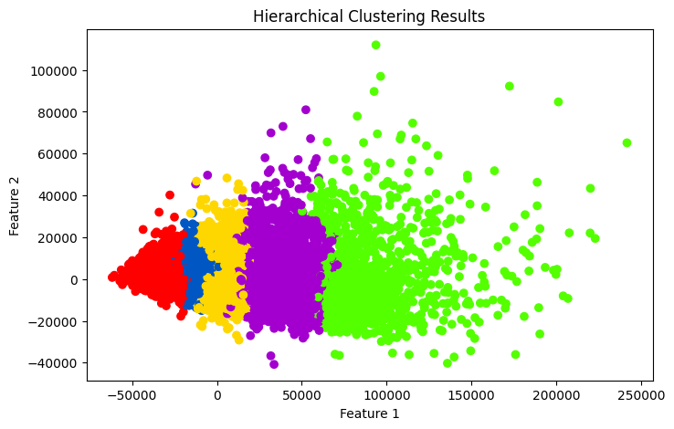
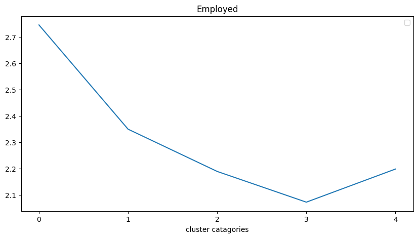
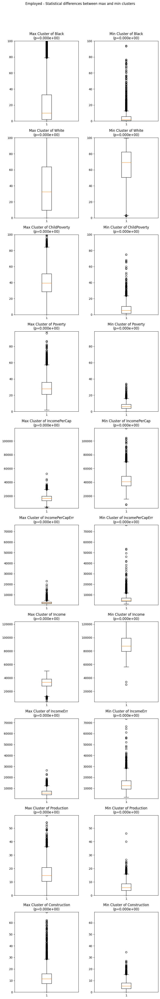
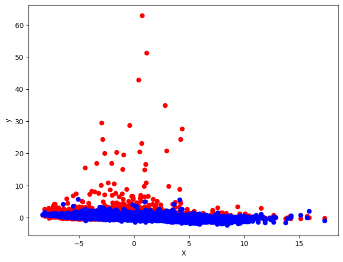
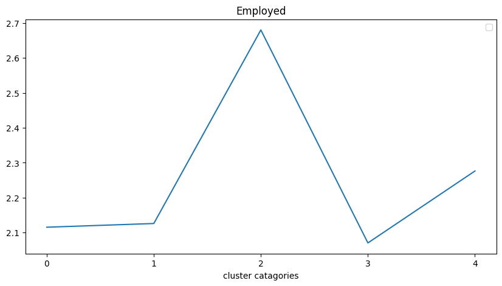

### 1) Whether we can establish a model to predict the future employment rate based on this employment pattern?

我们建立了两种模型来尝试预测就业率。

### 预处理

在训练模型之前，我们需要对原始数据做一些处理：

1. 将数据分离成输入数据以及训练目标。
2. 将这些数据分离为训练集，测试集方便评估性能。
3. 将训练与测试数据进行标准化处理以消除数据尺度不一的影响。

### 多项式线性回归模型

我们用一个多项式线性回归模型来尝试直接拟合数据，与一般线性模型的区别是，我们在将特征输入线性模型之前先对数据进行多项式展开，这有助于模型捕获非线性信息并增加精度。

- 我们的模型在训练集的训练误差(mse)达到了 0.2454

#### 可视化预测结果

我们使用 PCA 方法将输入和输出都压缩到一个维度，方便可视化与评估模型性能。

#### 深度学习预测模型

我们使用几层简单的 MLP 并结合 Attention 结构搭建了一个深度学习的模型。我们期望使用 Attention score 来反映模型认为输入特征之间的相关性，这相当于模型内部的一个相关性系数矩阵。当模型的精度足够高时，这些 attention score 可以代替相关性系数矩阵来更精确地反映输入特征之间的重要性。

##### 性能指标

我们在在测试集上面达到了 0.1610 的误差(mse)

##### 相关性分析

这是模型的 Attention score 的热力图：

拿收入举例，模型认为与收入有强烈正相关性的有 Production，负相关的有 TopPop 与性别。

##### 输入特征的对于输出的重要性

我们尝试使用模型梯度来展示模型认为输入的哪些特征是重要的。我们将输出的梯度通过模型回传，最后可以计算得到输入特征的梯度，某项输入的梯度绝对值越大，那么模型认为这些输入是更重要的。

- 这是相关性系数矩阵中输入特征对于输出特征的相关性：

  

- 这是对模型进行梯度分析的结果：

  

我们可以发现相关性系数认为较多的特征都是与输出相关的，而梯度分析的结果比相关性系数矩阵更精确地反映了输入特征对于输出特征的重要性。其中我们可以通过观察发现模型认为对就业率有强烈相关的输入特征有

- 正相关:Men，Poverty。
- 负相关:Women，IncomePerCap

### 2) Whether we can establish a clustering model to analyze the common characteristics of a population under a certain employment rate?

我们使用层次聚类模型来尝试对输入特征进行聚类，经过训练后，模型的树状图如下:

##### 聚类分析

我们使用散点图结合 PCA 将聚类结果可视化，每一种颜色代表一种颜色：

观察结果发现，数据发生了很明显的群聚现象，聚类模型能够很轻松地将数据分为多个类别。这意味着数据中同一簇中的数据它们更倾斜于拥有相似的特征。

##### 层次化

我们将不同簇的 Employ rate 求平均，我们可以发现不同簇的 Employ rate 出现了明显的层次化现象：

这基本证明我们猜想的正确性，不同一簇的数据更倾向于由于不同的特征。

##### 特征数据分布

We want to compare the clusters with the highest and lowest employ rate, and try to find out some common features within the same cluster and accross different cluster.

- We use t-test to identify the top n features that contribute the most to these clusters.
- Then, we compare the data distribution of these features using a box plot.

  

我们可以发现就业率高的组与就业率的组在这些 top n features 中的数据分布发生了显著的差异。拿其中的几个举例：

- 就业率更高的簇倾向于更低的薪资，而就业率更低的簇倾向于更高的薪资。
- 就业率更高的簇儿童时期贫困率更高，而就业率儿童时期贫困率更低。
- 就业率更高的簇黑人占比更高而白人占比更低，而就业率更低的簇黑人占比更低而白人占比更高。

这反映了就业率更低的那一个簇更类似于精英阶层的集合，而就业率更高的簇更倾向于代表底层民众，他们更倾向于体力性、重复性劳动，同时贫困发生率更高。

### 3) Can we generalize the conclusions and models we have drawn from this dataset to other relevant datasets?

我们尝试将我们的模型泛化到 2017 年的数据集上，如果 2015 年的数据集能在 2017 年的数据集上有不错的泛化效果，那么这意味着我们的结论在时间上的影响不大，这些数据集也许可以被泛化到时间跨度更长的数据集中。

#### 深度学习模型泛化

我们将我们在 2015 年数据集上训练的深度学习模型在 2017 年数据集上进行泛化，取得了 0.3248 的(mse)

泛化结果可视化如下：

泛化结果勉强可以接受，看图发现模型是出现了一定程度的过拟合。我们的结论也可以在一定程度上迁移到 2017 年的数据集上。

#### 层次聚类

我们在 2017 年的数据集上进行层次聚类，抽出其就业率，我们可以发现其就业率在不同的簇上也发生了一定的分层现象，这说明我们的聚类结论也可以在一定程度上应用到未来的数据集上。

总结来说，我们的模型在 2017 年的数据集上面表现的不如在 2015 年的测试集上，但是还在可接受范围内。我们仍然可以在一定时间跨度内沿用我们的部分结论，但是时间跨度一旦拉长就显得我们的结论不够精确。
