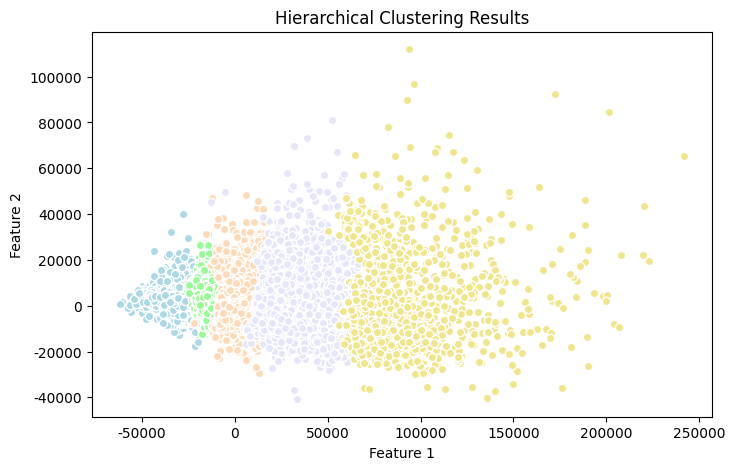
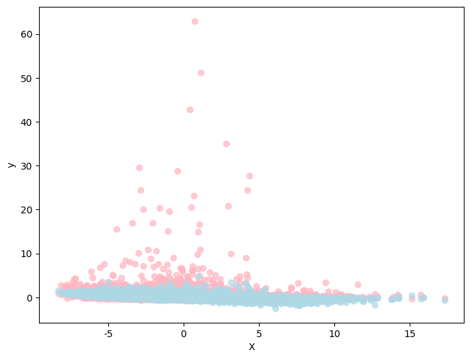

### 1) Whether we can establish a model to predict the future employment rate based on this employment pattern?

#### Deep Learning Prediction Model
We established a simple deep learning model with several MLP layers that includes an Attention structure. We expect the Attention scores to reflect the model's perceived correlations between input features, akin to a correlation coefficient matrix within the model. When the model's accuracy is sufficiently high, these attention scores can replace the correlation coefficient matrix to more accurately reflect the importance between input features.

##### Training Preprocessing
Before feeding data into the model for training, we standardized the data. This step eliminates the influence of different data scales on the model and enhances the model's stability.

##### Performance Metrics
We achieved an error (mse) of 0.1610 on the test set.

##### Correlation Analysis
Here is the heatmap of the model's Attention scores:

For instance, regarding income, the model identifies a strong positive correlation with production and a negative correlation with TotalPop and gender.

##### Feature Importance to Output
We attempted to use model gradients to show which input features are deemed important by the model. By backpropagating the output gradients through the model, we can compute the gradients of the input features. The larger the absolute gradient of an input feature, the more important the model considers that input to be.

- Here is the correlation matrix of input features to the output feature:

- Here is the result of the gradient analysis on the model:

We find that features highly correlated according to the correlation matrix are indeed related to the output. The gradient analysis results more precisely reflect the importance of input features to the output. Notably, the model indicates that the input features with strong correlations to the employment rate are:
- Positively correlated: Men, Poverty.
- Negatively correlated: Women, IncomePerCap.

### 2) Whether we can establish a clustering model to analyze the common characteristics of a population under a certain employment rate?

We used a hierarchical clustering model to cluster the input features. After training, the model's dendrogram is as follows:

##### Clustering Analysis
We visualized the clustering results with a scatter plot combined with PCA, where each color represents a different cluster:

The results show a clear clustering phenomenon, indicating that the model can easily classify the data into multiple categories. This implies that data within the same cluster tends to have similar characteristics.

##### Stratification
We averaged the employment rates of different clusters and observed a clear stratification of employment rates across different clusters:

This essentially proves our hypothesis that data in the same cluster is more likely to be characterized by specific features.

##### Feature Data Distribution
We aim to compare clusters with the highest and lowest employment rates and identify common features within the same cluster and across different clusters.

- We used a t-test to identify the top n features that contribute the most to these clusters.
- We then compared the data distribution of these features using a box plot.

We found significant differences in data distribution for these top n features between clusters with **highest and lowest employment rates**. For instance:
- Clusters with higher employment rates tend to have lower income, whereas clusters with lower employment rates tend to have higher income.
- Clusters with higher employment rates have a higher childhood poverty rate, whereas clusters with lower employment rates have a lower childhood poverty rate.
- Clusters with higher employment rates have a higher percentage of black individuals and a lower percentage of white individuals, while the opposite is true for clusters with lower employment rates.

This suggests that clusters with lower employment rates are more representative of the elite class, while clusters with higher employment rates are more representative of the lower class, who are more likely to engage in physical and repetitive labor and have higher poverty rates.

### 3) Can we generalize the conclusions and models we have drawn from this dataset to other relevant datasets?

We attempted to generalize our model to the 2017 dataset. If the model trained on the 2015 dataset generalizes well to the 2017 dataset, it suggests that our conclusions may be generalized to datasets over a longer time span.

#### Generalization of the Deep Learning Model
We generalized our deep learning model trained on the 2015 dataset to the 2017 dataset, achieving an mse of 0.3248.

Here is the visualization of the generalization results:

The generalization results are barely acceptable. The model shows some degree of overfitting. Our conclusions can be partially transferred to the 2017 dataset.

#### Hierarchical Clustering
We performed hierarchical clustering on the 2017 dataset and extracted its employment rate. We observed a stratification phenomenon in employment rates across different clusters, suggesting that our clustering conclusions can be somewhat applied to future datasets.

In summary, our model performed worse on the 2017 dataset than on the 2015 test set, but it is still within an acceptable range. We can partially apply our conclusions over a certain time span, but the precision of our conclusions diminishes as the time span increases.
